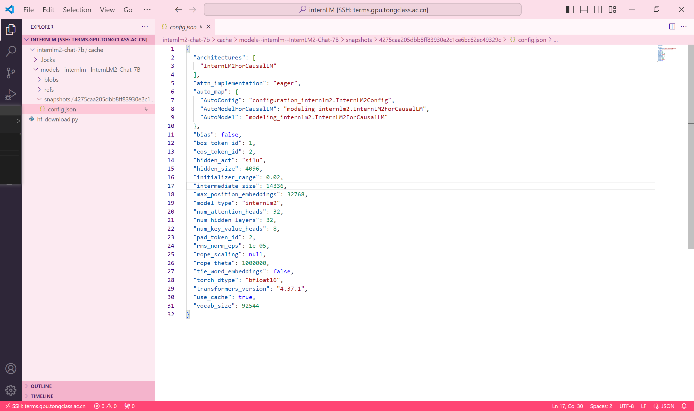

# Basic Work
## Use InternLM2-Chat-1.8B to generate story with 300 words

# Advanced Work
## 1. Use huggingface_hub to download file config.json of InternLM2-Chat-7B
### install huggingface_hub:

### write code to download by using huggingface_hub

### download successfully

## 2. Play with InternLM-XComposer2
### 图文创作、视觉问答：

open web to use:
 

### Lagent的数据分析：
